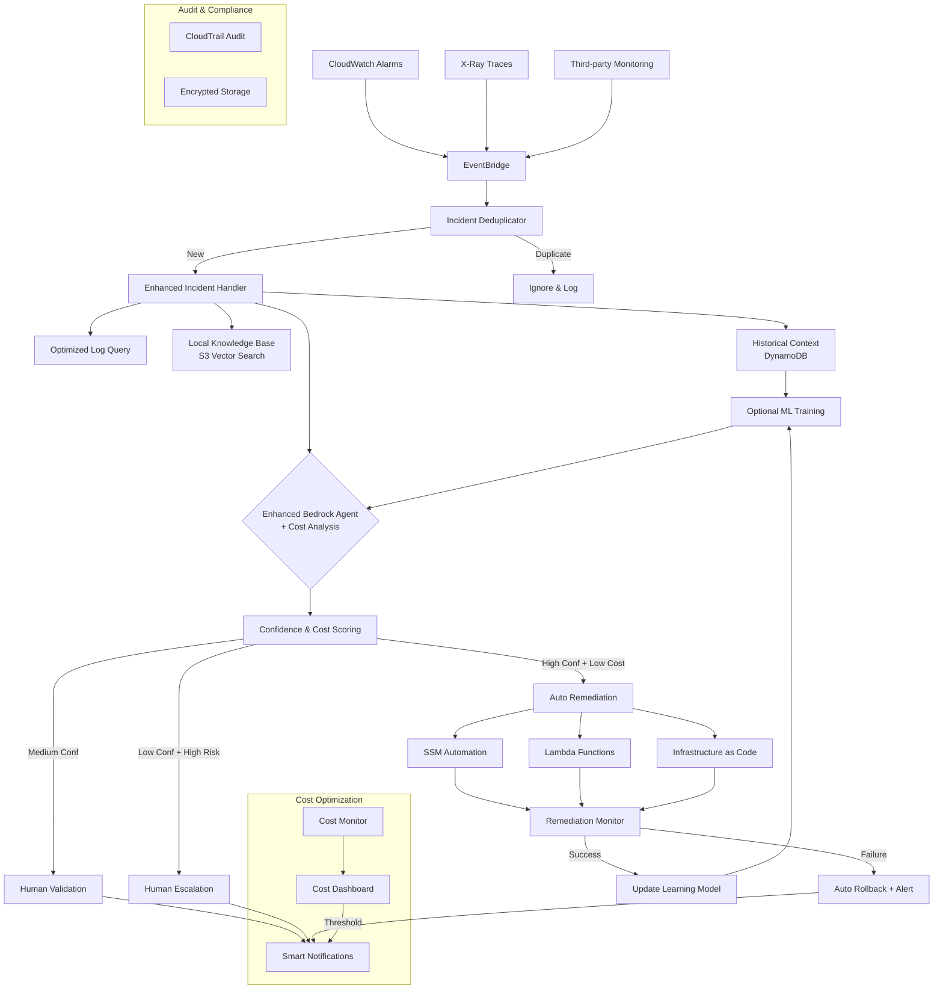

# Architecture Comparison: Original vs Improved

## Original Architecture (from chat)

```mermaid
graph LR
A[CloudWatch Alarm] -->|Triggers| B(EventBridge)
B --> C[Lambda: Incident Handler]
C --> D[Fetch Logs: CloudWatch + X-Ray]
C --> E[Store Context in S3]
C --> F[Invoke Bedrock Agent via AgentCore]

F --> G{Bedrock Agent<br>Reasoning LLM<br>(Claude 3.5)}
G --> H[Query Amazon Q Runbooks<br>via API]
G --> I{Confidence High?}
I -->|Yes| J[Execute via AgentCore Tools:<br>- SSM Automation<br>- Lambda Remediation]
I -->|No| K[Notify Human via SNS/Slack]

J --> L[Log Outcome to S3 + CloudWatch]
K --> L
```

## Improved Architecture



## Key Improvements Summary

### 🎯 **Cost Optimizations**

1. **Deduplication**: Prevent processing duplicate incidents
2. **Local Knowledge Base**: Replace expensive Amazon Q calls
3. **Intelligent Batching**: Process multiple incidents efficiently
4. **Cost-Aware Decisions**: Choose cheapest effective remediation
5. **Optimized Queries**: Targeted CloudWatch Logs searches

### 🚀 **Enhanced Features**

1. **Rollback Capability**: Auto-revert failed changes
2. **Multi-Modal Remediation**: SSM + Lambda + IaC options
3. **Historical Learning**: Learn from past incidents
4. **Real-time Monitoring**: Track remediation progress
5. **Cost Dashboard**: Monitor spending in real-time

### 📊 **Better Reliability**

1. **Confidence Scoring**: More accurate decision making
2. **Incident Correlation**: Handle complex multi-service issues
3. **Failure Recovery**: Automatic rollback on failures
4. **Audit Trail**: Complete compliance logging
5. **Human Escalation**: Smart escalation based on risk/cost

### 💰 **Cost Comparison**

- **Original**: $85-250/month
- **Improved**: $50-120/month
- **Savings**: 40-52% reduction
- **Hackathon Budget**: $25-60 (well within $100 credits)

This improved architecture maintains all hackathon compliance requirements while significantly reducing costs and adding enterprise-grade features.
